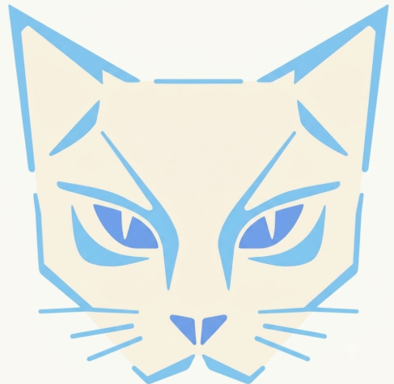
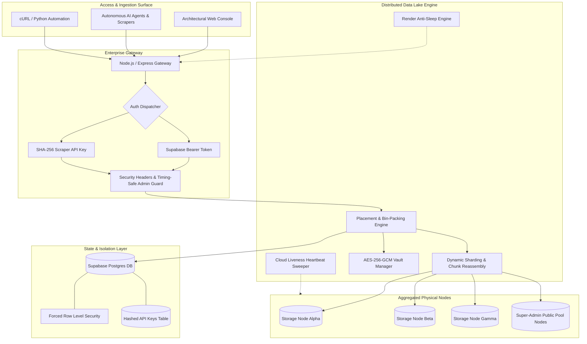
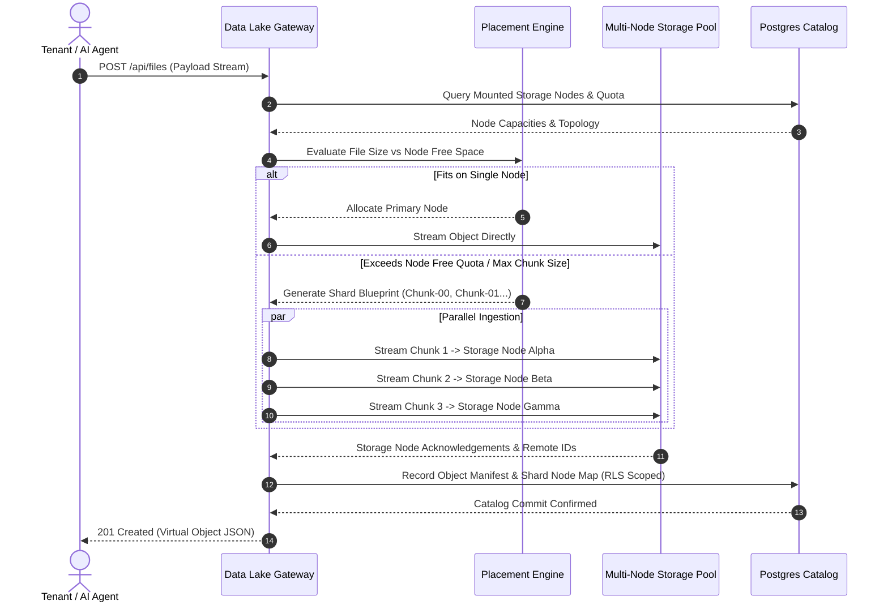
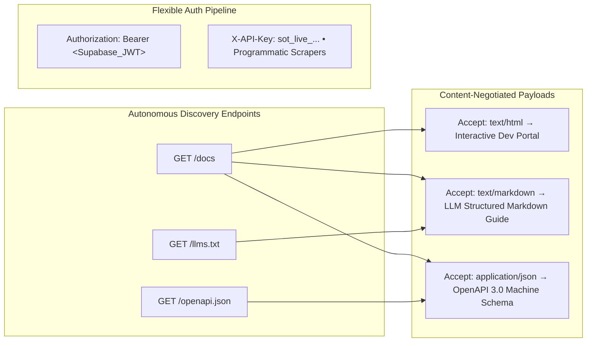
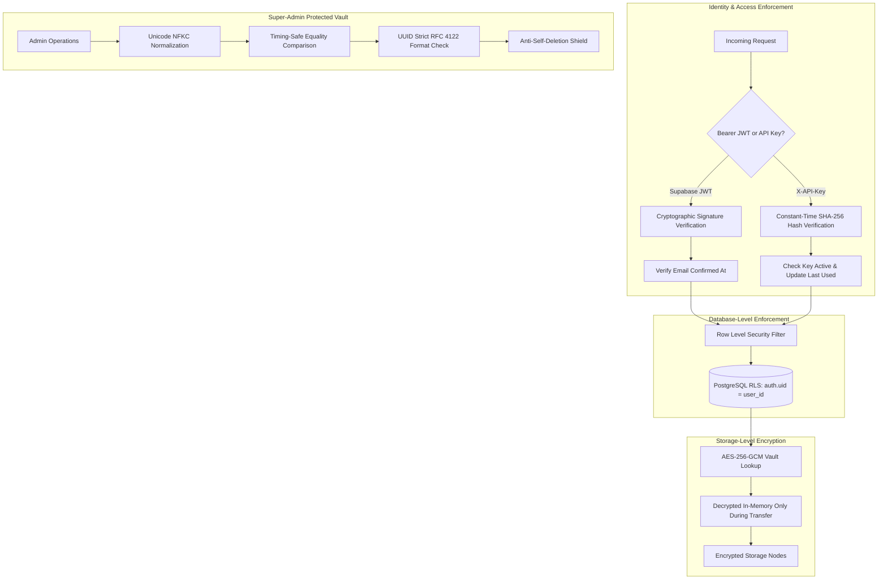

# SoTaNik_AI Data Lake

<p align="center">
  
</p>

<p align="center">
  <strong>Autonomous Multi-Node Storage Aggregation &bull; High-Density Sharding &bull; Zero Vendor Lock-in</strong>
</p>

<p align="center">
  
  
  
  
  
</p>

---

## 🏛️ System Architecture Overview



---

## 🧰 Technology Stack Ecosystem

| Layer | Technologies & Frameworks | Function & Responsibility |
|---|---|---|
| **Core Runtime** | `Node.js 20+` &bull; `Express 4.x` &bull; `HTTP/1.1 Streaming` | High-throughput async ingestion engine with 30-minute upload socket stability. |
| **Persistence & Auth** | `Supabase` &bull; `PostgreSQL 15` &bull; `pgcrypto` &bull; `PostgREST` | Multi-tenant auth, session verification, and catalog indexing guarded by RLS. |
| **Cryptography** | `AES-256-GCM` &bull; `PBKDF2` &bull; `SHA-256` &bull; `Constant-Time Equal` | Node credential envelope encryption and timing-safe admin authorization. |
| **Storage Pooling** | `Megajs Engine` &bull; `Greedy Bin-Packing` &bull; `Chunk Sharding` | Transparent multi-account aggregation into unified zero-fragmentation drives. |
| **Interface & UX** | `Vanilla CSS3` &bull; `HTML5 Semantic` &bull; `Plus Jakarta Sans` &bull; `JetBrains Mono` | Zero-dependency matte editorial UI, collapsible sidebar, and keyboard shortcuts. |
| **AI & Bot Discovery** | `OpenAPI 3.0.3` &bull; `LLMs.txt Standard` &bull; `RESTful JSON API` | Native content negotiation, machine-readable specifications, and agent scraping. |

---

## ⚡ Data Ingestion & Sharding Pipeline



---

## 📊 Platform Capability Matrix

| Capability | SoTaNik_AI Data Lake | Traditional Cloud Drives | Generic S3 / Object Stores |
|---|:---:|:---:|:---:|
| **Multi-Node Aggregation** | ✅ Unlimited Accounts Pooled | ❌ Single Account Locked | ⚠️ Single Account / Bucket |
| **Dynamic Auto-Sharding** | ✅ Automatic Multi-Node Slicing | ❌ Fails on File > Quota | ⚠️ Requires Manual Multipart |
| **Tenant Data Privacy** | ✅ Hardware Isolation + RLS | ❌ Platform Monitored | ⚠️ Complex IAM Policies |
| **Zero Vendor Lock-in** | ✅ Multi-Provider Virtual Lake | ❌ Proprietary Ecosystem | ❌ Vendor Specific Formats |
| **AI Agent Scraping Ready** | ✅ `/docs` + `/llms.txt` + OpenAPI | ❌ Heavy Web Login Only | ⚠️ Raw API Without Context |
| **Programmatic API Keys** | ✅ SHA-256 Scraper Keys | ❌ OAuth Refresh Complexity | ✅ IAM Access Keys |
| **Credential Storage** | ✅ AES-256-GCM Envelope Encryption | ❌ Stored by Provider | ⚠️ Plaintext IAM Secrets |
| **Inactivity Keep-Alive** | ✅ Render Anti-Sleep + Account Pings | ❌ Inactive Account Purges | ❌ N/A |
| **Super-Admin Node Allocator** | ✅ Dynamic Public Node Pooling | ❌ Rigid Workspace Plans | ❌ Cross-Account Complex |

---

## 🎨 Design Philosophy: Architectural Matte Palette

The interface is engineered around an architectural editorial aesthetic with strict sharp edges (`border-radius: 0px` across all components) and zero neon glare:

```
Warm Matte Cream Mode (Daylight Engineering):
┌─────────────────────────────────────────────────────────────┐
│  Base Canvas:       #f5f2eb   [Parchment Cream]             │
│  Containers:        #fbf9f5   [Alabaster Surface]           │
│  Borders:           #ddd6c7   [Muted Stone Edge]            │
│  Typography:        #1c1917   [Deep Obsidian Ink]           │
│  Architectural Accent: #786148 [Antique Architectural Bronze]│
└─────────────────────────────────────────────────────────────┘

Deep Obsidian / Charcoal Mode (Low-Light Command):
┌─────────────────────────────────────────────────────────────┐
│  Base Canvas:       #141312   [Deep Obsidian Void]          │
│  Containers:        #1c1a18   [Matte Charcoal Slate]        │
│  Borders:           #2e2a26   [Subtle Boundary Line]        │
│  Typography:        #f5f2eb   [Warm Cream Glyphs]           │
│  Architectural Accent: #bba083 [Champagne Bronze]           │
└─────────────────────────────────────────────────────────────┘
```

---

## 🤖 AI Agent & Automated Scraper Surface

The platform provides dedicated, self-documenting interfaces tailored for automated crawlers, LLM agents, and external scripts:



### Discovery Endpoints Summary

| Endpoint | Protocol | Consumer | Payload Description |
|---|---|---|---|
| `/docs` | HTTP GET | Browsers / Agents | Content-negotiated developer portal, LLM guide, or OpenAPI schema. |
| `/docs/llms.txt` | HTTP GET | AI Agents & LLMs | Structured markdown context guide following the `llms.txt` standard. |
| `/docs/openapi.json` | HTTP GET | Automated Tools | Full OpenAPI 3.0.3 machine-readable schema for client generation. |
| `/api/files` | REST GET/POST | Tenants & Scrapers | List pool objects, filter by type, or ingest high-capacity payloads. |
| `/api/files/:id/download` | REST GET | Tenants & Scrapers | Direct transparent streaming download with automated chunk reassembly. |
| `/share/:token` | HTTP GET | Public Consumers | Unauthenticated signed token stream endpoint with time expiration. |
| `/api/keys` | REST GET/POST/DEL | Tenant Admins | Provision, list, and revoke cryptographically hashed scraper API keys. |

---

## 🛡️ Enterprise Security & Defense-in-Depth



---

## 📋 Comprehensive Feature Scorecard

| Category | UI & Platform Features Included |
|---|---|
| **Storage Management** | Multi-Account Storage Pooling &bull; Greedy Load-Balancing &bull; Automatic Chunk Slicing &bull; Public Stream Share Tokens with Expiration &bull; Batch Ingestion Dropstrip &bull; Instant Shard Inspector Modal |
| **Catalog & Navigation** | Real-Time Live Search (`/`) &bull; Category Filter Pills (Datasets, Docs, Media, Archives, Code) &bull; Multi-Column Sorting &bull; Table vs. Technical Grid View (`V`) &bull; 1-Click JSON Lake Manifest Export |
| **Security & Privacy** | AES-256-GCM Master Key Envelope Encryption &bull; Supabase Row Level Security &bull; Timing-Safe Constant-Time Admin Checks &bull; Unicode Anti-Spoofing &bull; IP-Based Sliding Window Rate Limiting |
| **Automations & Anti-Sleep** | Render Container Self-Ping Keep-Alive (`src/keepAlive.js`) &bull; 24-Hour Cloud Storage Account Anti-Deactivation Heartbeat (`src/cloudHeartbeat.js`) |
| **Automation & Scrapers** | Programmatic Scraper API Keys (`sot_live_...`) &bull; Content-Negotiated `/docs` Portal &bull; `/llms.txt` Agent Context Standard &bull; Machine-Readable OpenAPI 3.0.3 Specification |
| **Super-Admin Console** | Dedicated Control Panel for Master Admin &bull; Full Tenant Account & Cloud Physical Chunk Purge &bull; Public Storage Node Pool &bull; Manual Tenant Storage Allocation &bull; Manual Heartbeat Trigger |
| **Layout & Ergonomics** | Collapsible Infrastructure Sidebar (`B`) &bull; 2x2 Mini Telemetry Matrix &bull; Real-time Cluster Load Advisor &bull; Global Keyboard Navigation (`?`) &bull; Dual Warm Matte Cream / Deep Obsidian Themes (`M`) |

---

<p align="center">
  <strong>SoTaNik_AI Data Lake &bull; Architectural Data Lake Infrastructure</strong>
</p>
